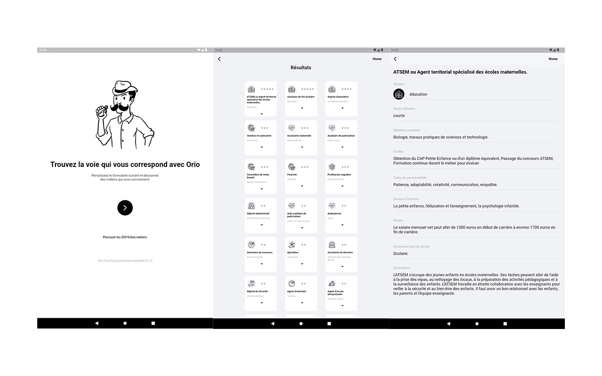
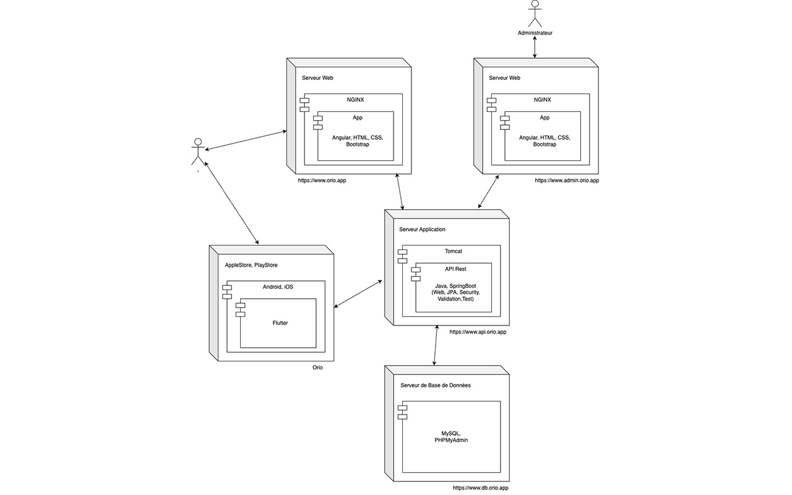

# Orio API

## Introduction
Orio a été créée pour aider les lycéens à prendre des décisions éclairées concernant leur orientation et leur avenir professionnel.



Dans un nouvel élan d'innovation, le projet Orio est repris à zéro, avec une approche collaborative et open source. Cette décision vise à tirer parti des contributions diverses et à créer le projet de manière collective.

Parmi les fonctionnalités clés de l'application à venir :
- 559 fiches métier complètes pour une exploration approfondie.
- Un quizz interactif amusant pour découvrir les affinités professionnelles.
- Des mises à jour régulières avec de nouvelles fonctionnalités et des métiers ajoutés.
- Une interface conviviale pour une expérience utilisateur optimale.
- Possibilité de personnaliser et adapter l’application aux besoins des utilisateurs.

Cette transition vers un modèle de développement open source renforcera la robustesse de l'application Orio et permettra une évolution continue grâce à la collaboration variée.

Le développement d'Orio se déroulera en quatre parties distinctes : l'API, la version web, l'application mobile et le panneau administrateur. Chaque aspect sera pris en charge pour garantir une expérience complète et adaptée aux différents besoins des utilisateurs.



## Projet Information

- **Java Version:** 17
- **Spring Boot Version:** 3.2.3

## Dépendances

### 1. Spring Boot Starter Data JPA

```xml
<dependency>
    <groupId>org.springframework.boot</groupId>
    <artifactId>spring-boot-starter-data-jpa</artifactId>
</dependency>
```
Cette dépendance fournit les composants nécessaires pour l'accès aux données en utilisant Java Persistence API (JPA).

### 2. Spring Boot Starter Security
```xml
<dependency>
    <groupId>org.springframework.boot</groupId>
    <artifactId>spring-boot-starter-security</artifactId>
</dependency>
```
Cette dépendance inclut Spring Security pour gérer les aspects de sécurité dans l'application.

### 3. Spring Boot Starter Web
```xml
<dependency>
    <groupId>org.springframework.boot</groupId>
    <artifactId>spring-boot-starter-web</artifactId>
</dependency>
```
Cette dépendance est utilisée pour construire des services web RESTful avec Spring MVC.

### 4. Spring Boot DevTools
```xml
<dependency>
    <groupId>org.springframework.boot</groupId>
    <artifactId>spring-boot-devtools</artifactId>
    <scope>runtime</scope>
    <optional>true</optional>
</dependency>
```
Spring Boot DevTools fournit des améliorations au niveau du développement, telles que des redémarrages automatiques.

### 5. Connecteur MySQL
```xml
<dependency>
    <groupId>com.mysql</groupId>
    <artifactId>mysql-connector-j</artifactId>
    <scope>runtime</scope>
</dependency>
```
Cette dépendance permet à l'application de se connecter à une base de données MySQL.

### 6. Lombok
```xml
<dependency>
    <groupId>org.projectlombok</groupId>
    <artifactId>lombok</artifactId>
    <optional>true</optional>
</dependency>
```
Lombok est utilisé pour réduire le code redondant dans les classes Java.

### 7. Spring Boot Starter Test
```xml
<dependency>
    <groupId>org.springframework.boot</groupId>
    <artifactId>spring-boot-starter-test</artifactId>
    <scope>test</scope>
</dependency>
```
Cette dépendance inclut un support de test pour l'application Spring Boot.

### 8. Spring Security Test
```xml
<dependency>
    <groupId>org.springframework.security</groupId>
    <artifactId>spring-security-test</artifactId>
    <scope>test</scope>
</dependency>
```
Cette dépendance fournit un support de test pour les composants de Spring Security.
